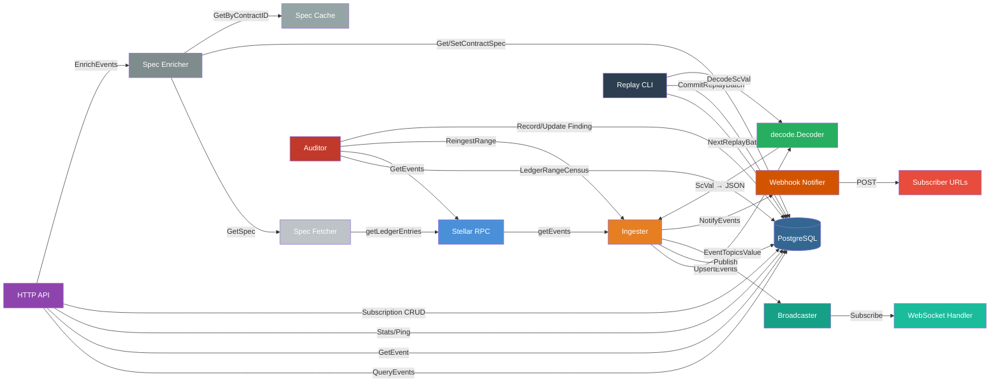

# SoroTrail Architecture

## Overview

SoroTrail is a contract event indexer for the Stellar/Soroban network. It polls
a Stellar RPC endpoint for contract events, stores them durably in PostgreSQL,
and serves them back through a queryable HTTP API long after the RPC has dropped
them (RPC retention is only ~24 hours to 7 days).

## Data Flow

## Component Descriptions

### [`cmd/sorotrail`](../cmd/sorotrail/main.go) — Main entrypoint

Wires all dependencies, runs database migrations, then starts four goroutines:

1. **Ingester** — polling loop (blocking until context cancel)
2. **HTTP API** — `http.Server` listening on the configured address
3. **Webhook notifier** — background worker pool draining the delivery queue
4. **Auditor** (optional, `AUDIT_ENABLED=true`) — background ledger verifier

Graceful shutdown catches SIGINT/SIGTERM: the server stops accepting new
connections, all goroutines drain, and the process exits once all components
have stopped.

### [`internal/rpc`](../internal/rpc/) — Stellar RPC client

Interface `rpc.Client` wraps the Stellar Soroban RPC JSON-RPC 2.0 methods:

- `GetEvents` — paginated event queries with filter batching (up to 5
  contract IDs per filter, up to 5 filters per request, max 25 watched
  contracts per request chain)
- `GetHealth` — latest/oldest ledger, server health status
- `GetLatestLedger` — current sequence number
- `GetLedgerEntries` — raw ledger entries (used by the spec fetcher)

The client handles JSON-RPC framing, error wrapping (including
`LedgerOutOfRange` for retention-boundary logic), and supports both
`xdrFormat: "json"` (server-decoded) and base64 XDR responses.

**Extension interface:** `rpc.Client` — add new RPC methods here as the
ingester or API needs them; the client is deliberately not a full RPC SDK.

### [`internal/decode`](../internal/decode/) — ScVal decoder

Interface `decode.Decoder` has a single method `DecodeScVal(base64XDR string)`
that converts a base64-encoded XDR ScVal into a JSON `json.RawMessage`.

The default `XDRDecoder` (in `xdr.go`) handles all Soroban ScVal types:
`scvBool`, `scvVoid`, `scvI32`, `scvU32`, `scvI64`, `scvU64`, `scvI128`,
`scvU128`, `scvI256`, `scvU256`, `scvSymbol`, `scvBitset`, `scvStatus`,
`scvBytes`, `scvAddress`, `scvString`, `scvVec`, `scvMap`, `scvContractInstance`,
`scvLedgerKeyContractInstance`, `scvTimePoint`, `scvDuration`, `scvUdt`,
and `scvError`.

When the RPC returns `xdrFormat: "json"`, the server-decoded `topicJson` /
`valueJson` fields are used verbatim — the decoder is only invoked for
base64 XDR payloads.

**Extension interface:** `decode.Decoder` — implement for richer decoding
(e.g., custom type handling), or build per-standard decoders (SEP-41 token
events, etc.) as layers on top of the stored JSON.

### [`internal/store`](../internal/store/) — Persistence layer

Interface `store.Store` abstracts all database operations behind an interface
so alternative backends can be contributed without changing the ingester or API.

Key methods:

| Method | Used by | Purpose |
| --- | --- | --- |
| `UpsertEvents` | Ingester | Idempotent insert (ON CONFLICT DO NOTHING) |
| `ReplaceEventsInRange` | Auditor | Delete-and-reinsert for repair (ON CONFLICT DO UPDATE) |
| `GetEvent` / `EventExists` | API | Single-event lookup with conditional GET support |
| `QueryEvents` | API | Paginated filtered queries, ascending/descending |
| `GetIngestionState` / `SaveIngestionState` | Ingester | Resume cursor persistence |
| `GetAuditState` / `SaveAuditStateIfGreater` | Auditor | Verification high-water mark |
| `LedgerRangeCensus` | Auditor | Per-ledger event counts/IDs for reconciliation |
| `CreateSubscription` / … | API | Webhook subscription CRUD |
| `ListEnabledSubscriptions` | Webhook | Delivery routing |
| `RecordDeliveryAttempt` / `ListDeliveryAttempts` | Webhook | Delivery history |
| `GetContractSpec` / `SetContractSpec` | Spec cache | Wasm spec persistence |
| `RecordAuditFinding` / `UpdateAuditFinding` | Auditor | Finding lifecycle |
| `Stats` | API | Aggregate counters |
| `Ping` | API | Health check |

The PostgreSQL implementation (`*Postgres`) also provides replay-specific
persistence (`AcquireReplayLock`, `GetReplayState`, `NextReplayBatch`,
`CommitReplayBatch`) through a narrower interface consumed by
`internal/replay`.

The `events` table is **partitioned by ledger range** (default span:
120,960 ledgers ≈ 7 days). Partition creation is automatic via the
`ensure_event_partitions()` PL/pgSQL function, called before every batch
insert.

**Extension interface:** `store.Store` — implement the full interface to
swap in an alternative storage backend.

### [`internal/ingester`](../internal/ingester/) — Polling loop

The `Ingester` runs the core ingestion cycle:

1. **Resolve position** — read the persisted cursor or last ingested
   ledger from `ingestion_state`. On cold start, fall back to
   `latest − RETENTION_LEDGERS` (default ~24h), clamped to the RPC's
   oldest retained ledger.
2. **Build filter batches** — read the watched-contract list and group
   contract IDs into RPC-compliant filter batches (≤5 per filter, ≤5
   filters per request). An empty watch list produces a single
   `type: "contract"` filter that captures all contract events.
3. **Page through RPC** — call `GetEvents` with the resume cursor,
   decoding each event via `decode.EventTopicsValue`.
4. **Persist** — upsert decoded events into the store, then advance
   the ingestion state cursor.
5. **Notify** — fire the `EventNotifier` (webhook delivery) and
   `Broadcaster` (WebSocket stream) after each successful batch.

Two pagination strategies handle different watch-list sizes:

- **Single-page** (≤25 watched contracts): one `getEvents` call per
  pass; cursor-based resumption for fine-grained progress.
- **Window sweep** (>25 watched contracts): each filter batch pages
  through a bounded ledger window (default 1000 ledgers) independently,
  then advances the state past the window. Idempotent upserts make
  re-scanning on crash harmless.

Errors are retried with jittered exponential backoff (1s → 2s → 4s …
→ `MaxBackoff`). If the resume point ages out of RPC retention, the
ingester logs a warning and skips ahead to the oldest retained ledger.

**Extension interface:** `ingester.EventNotifier` — attach post-ingest
hooks (webhook delivery, SSE, etc.) without modifying the loop.

### [`internal/broadcast`](../internal/broadcast/) — Pub-sub stream

The `Broadcaster` distributes ingested events to live subscribers (WebSocket
connections). Each subscriber registers with a `store.EventFilter` and receives
matching events on a buffered channel (default: 64 events). Slow consumers are
silently evicted to prevent back-pressure on the ingester.

- `Subscribe(filter)` — returns a `Subscription` with a read-only
  `Events()` channel.
- `Publish(ctx, events)` — fans out to all subscribers whose filter
  matches; drops subscribers whose channel is full.
- `SubscriberCount()` — observable metric for operators.

The broadcaster is wired in `main.go` and consumed by the WebSocket
handler (`GET /events/ws`).

### [`internal/webhook`](../internal/webhook/) — Async delivery

The `Notifier` implements `ingester.EventNotifier` and delivers events to
registered webhook subscriptions asynchronously:

- **Queue**: buffered channel (4096 tasks), 4 concurrent workers.
- **HMAC signing**: every POST carries `X-SoroTrail-Signature` — the
  hex-encoded HMAC-SHA256 digest of the body, keyed with the
  subscription's secret.
- **Retry**: exponential backoff (1s → 2s → 4s → 8s → 16s), up to 5
  attempts.
- **Auto-disable**: after 5 consecutive failures, the subscription is
  disabled automatically. A successful delivery resets the failure
  counter.
- **Delivery history**: every attempt is recorded in `delivery_attempts`
  and queryable via `GET /subscriptions/{id}/deliveries`.

### [`internal/audit`](../internal/audit/) — Background verifier

The `Auditor` (optional, enabled via `AUDIT_ENABLED=true`) walks
recently-ingested ledger ranges behind the ingest frontier and reconciles
stored events against fresh RPC fetches:

1. **Lag pause**: sleeps until ingestion is at least `AUDIT_LAG_THRESHOLD`
   (default 200) ledgers ahead of the verified mark.
2. **Reconcile**: fetches the RPC's events for `[from, to]` using the
   *exact same filter batches* as the ingester, compares per-ledger
   counts, and advances the verified HWM over clean prefixes.
3. **Findings**: mismatches (missing events, orphans, count disagreement)
   are recorded in `audit_findings` and auto-repaired via
   `Ingester.ReingestRange`.
4. **Repair limits**: after `AUDIT_MAX_REPAIR_ATTEMPTS` (default 3)
   iterations without convergence, the finding moves to `unrecoverable`
   so operators can investigate.
5. **Retention edges**: if a finding's range ages out of RPC retention,
   it moves to `unverifiable` rather than looping forever.

The auditor shares the RPC request budget with the ingester via
`rpc.Budget`; the audit pool gets `AUDIT_BUDGET_SHARE` (default 10%) and
the ingest pool gets the remainder.

### [`internal/replay`](../internal/replay/) — Decoder replay

The `Replayer` (`sorotrail replay` subcommand) re-runs the current decoder
pipeline over stored raw XDR and rewrites the decoded columns. This applies
decoder improvements to already-indexed events without re-fetching from RPC.

Key design properties:

- **Pure function**: output depends only on raw XDR, never on the
  current decoded columns (except to detect changes).
- **Batched & resumable**: progress is persisted in the same transaction
  as rewrites; Ctrl-C stops cleanly, and re-running resumes where it
  left off.
- **Idempotent**: a row whose decoding hasn't changed is not rewritten.
- **Safe for live DB**: short transactions hold no table-level locks;
  concurrent ingestion is never blocked.
- **Advisory lock**: a PostgreSQL session-level advisory lock (key:
  `"SoroRepl"`) prevents two replays from running simultaneously.
  The lock auto-releases if the process dies.

### [`internal/spec`](../internal/spec/) — Contract spec enrichment

The `Enricher` attaches human-readable field names to events by fetching
and parsing the contract's Wasm spec entries:

1. **Fetch**: `Fetcher.FetchSpec` walks `contract ID → LedgerKeyContractData
   → wasm_hash → LedgerKeyContractCode → Wasm blob → `contractspecv0`
   custom section → XDR-parsed `[]ScSpecEntry`.
2. **Cache**: `Cache` stores parsed specs in-memory (`sync.Map`-backed)
   and durably in the `contract_specs` table.
3. **Enrich**: `Enricher.EnrichEvents` matches `topic[0]` (the event name
   symbol) to a spec entry, then maps positional topics and value to named
   fields.

Enrichment is opt-in: the API returns it when `?decoded=true` is set. Events
for contracts without a cached spec are returned with `decoded: false`.

### [`internal/config`](../internal/config/) — Configuration

All configuration is loaded from environment variables (via
`caarlos0/env`) at startup. See the [README configuration table](../README.md#configuration)
for the full list.

## Database Schema

The core tables (managed via numbered migrations in
[`internal/store/migrations/`](../internal/store/migrations/)):

| Table | Purpose |
| --- | --- |
| `events` | Partitioned by ledger range, stores decoded event data and raw XDR |
| `ingestion_state` | Singleton row tracking the ingester's resume cursor |
| `audit_state` | Singleton row tracking the auditor's verified HWM |
| `audit_findings` | Mismatches found and (un)repaired by the auditor |
| `watched_contracts` | Contract IDs the ingester should poll |
| `subscriptions` | Webhook callback registrations |
| `delivery_attempts` | Per-event delivery history |
| `contract_specs` | Parsed Wasm spec entries, keyed by wasm_hash |
| `replay_state` | Singleton row tracking decoder-replay progress |

## API Reference

The README API reference is the source of truth — every endpoint
includes its params table, a curl example, and an example JSON response
captured from a real local run. The table below is a quick index of
the same endpoints so a reader skimming this document can see the
surface at a glance.

### Endpoint summary

| Method | Path | Description |
| --- | --- | --- |
| `GET` | `/health` | Dependency health (DB + RPC) |
| `GET` | `/events` | Paginated, filtered event list |
| `GET` | `/events/{id}` | Single event by TOID |
| `GET` | `/contracts/{id}/events` | Events scoped to one contract |
| `GET` | `/events/ws` | WebSocket live stream |
| `GET` | `/stats` | Aggregate counters + audit metrics |
| `POST` | `/subscriptions` | Create webhook subscription |
| `GET` | `/subscriptions` | List all subscriptions |
| `GET` | `/subscriptions/{id}` | Get one subscription |
| `PUT` | `/subscriptions/{id}` | Update subscription fields |
| `DELETE` | `/subscriptions/{id}` | Delete subscription (204) |
| `GET` | `/subscriptions/{id}/deliveries` | Delivery attempt history |

## Extension points

- **`decode.Decoder`** — implement for new ScVal type handling
- **`store.Store`** — implement for alternative storage backends
- **`rpc.Client`** — add new RPC methods as needed
- **`ingester.EventNotifier`** — post-ingest hooks (webhooks, SSE, etc.)
- **Per-standard decoders** (SEP-41, etc.) — build on stored JSON, wire
  into `store.ReplayBatch` for backfill support
- **New API endpoints** — add routes in `internal/api/server.go`
- **Database migrations** — add numbered pairs to
  `internal/store/migrations/`

## Caching strategy

- **Single events** (`GET /events/{id}`): `Cache-Control: public,
  max-age=31536000, immutable` with a strong ETag (the event ID itself).
  Conditional GETs return 304 without re-serializing the row.
- **List pages** (`GET /events`, `GET /contracts/{id}/events`): a page
  whose `to_ledger` sits *strictly below* the ingest frontier is
  immutable. Open-ended or frontier-crossing pages get `no-cache` — the
  conservative choice.
- **Operational endpoints** (`/health`, `/stats`): `no-store` so
  monitoring sees real state.

See the [README caching section](../README.md#caching) for the full
rationale, including the `CACHE_PRIVATE` flag for auth'd deployments.

## Data integrity

The background auditor provides the strongest trust signal SoroTrail can
offer: `verified_through_ledger` in `/stats` names the highest ledger
whose stored events have been verified against the RPC, not merely
ingested. See the [Data integrity section](../README.md#data-integrity)
for the auditor's contract and edge-case handling.
